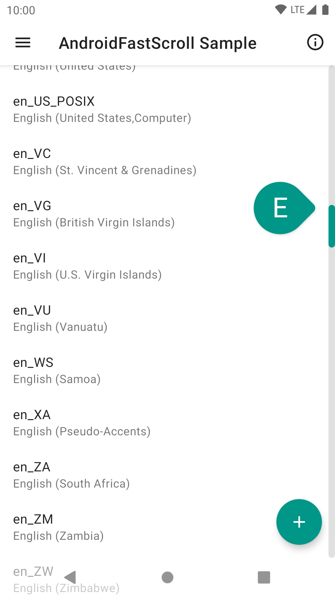

# AndroidFastScroll

[](https://github.com/zhanghai/AndroidFastScroll/actions) [](https://github.com/zhanghai/AndroidFastScroll/releases) [](LICENSE)

Fast scroll for Android `RecyclerView` and more.

This is not an officially supported Google product.

## Why AndroidFastScroll?

- Fully customizable: Override track, thumb, popup, animation and scrolling.
- Easy-to-use defaults: Predefined default style, Material Design 2 style and animation.
- Extensive view support: Out-of-box support for `RecyclerView`, `ScrollView`, `NestedScrollView` and `WebView`, plus any view with a `ViewHelper` implementation.
- Window insets friendly: Support setting a separate padding for scrollbar.
- Clean implementation: Decoupled touch handling, animation and scrolling logic.

## Preview

<a href="https://play.google.com/store/apps/details?id=me.zhanghai.android.fastscroll.sample" target="_blank"></a>

[Sample APK](https://github.com/zhanghai/AndroidFastScroll/releases/latest/download/sample-release.apk)

<p>
</p>

## Implementation

This library is loosely based on the following AOSP implementations:

- Framework `ListView` [`FastScroller`](https://android.googlesource.com/platform/frameworks/base/+/master/core/java/android/widget/FastScroller.java).
- AndroidX `RecyclerView` [`FastScroller`](https://android.googlesource.com/platform/frameworks/support/+/androidx-master-dev/recyclerview/recyclerview/src/main/java/androidx/recyclerview/widget/FastScroller.java).
- Launcher3 [`RecyclerViewFastScroller`](https://android.googlesource.com/platform/packages/apps/Launcher3/+/refs/heads/master/src/com/android/launcher3/views/RecyclerViewFastScroller.java).

## Integration

Gradle:

```gradle
implementation 'me.zhanghai.android.fastscroll:library:1.3.0'
```

This library uses [Java 8 bytecode](https://developer.android.com/studio/write/java8-support), so you will need to enable it in your project as well:

```gradle
android {
    ...
    // For Java projects
    compileOptions {
        sourceCompatibility JavaVersion.VERSION_1_8
        targetCompatibility JavaVersion.VERSION_1_8
    }
    // For Kotlin projects
    kotlinOptions {
        jvmTarget = JavaVersion.VERSION_1_8.toString()
    }
}
```

## Usage

Simply create a `FastScroller` with `FastScrollerBuilder`, and enjoy!

```java
new FastScrollerBuilder(recyclerView).build();
```

You can also implement [`PopupTextProvider`](library/src/main/java/me/zhanghai/android/fastscroll/PopupTextProvider.java) in your `RecyclerView.Adapter` to show a popup.

For more customization, please use the methods on [`FastScrollerBuilder`](library/src/main/java/me/zhanghai/android/fastscroll/FastScrollerBuilder.java). Namely:

- `setViewHelper()` allows providing a custom `ViewHelper` to support more views.
- `setPopupTextProvider()` allows providing a custom `PopupTextProvider` if your `RecyclerView.Adapter` cannot implement that interface.
- `setPadding()` allows setting a custom padding for the scrollbar, instead of the padding of the view.
- `setTrackDrawable()` and `setThumbDrawable()` allow setting custom drawables for the scrollbar. The `android:state_pressed` state will be updated for them so you can use a selector. The track drawable needs to have an intrinsic width and the thumb drawable needs to have an intrinsic size, in order to allow proper touch event handling.
- `setPopupStyle()` allows customizing the popup view with a lambda that will receive the view.
- `setAnimationHelper()` allows providing a custom `AnimationHelper` to use an alternative scrollbar animation.
- `disableScrollbarAutoHide()` allows disabling the auto hide animation for scrollbar. This implies using a `DefaultAnimationHelper`.
- `useDefaultStyle()` and `useMd2Style()` allow using the predefined styles, which sets the drawables and popup style. `useDefaultStyle()`, as its name suggests, is the default style when a `FastScrollerBuilder` is created.

The default `ViewHelper` implementation for `RecyclerView` supports both `LinearLayoutManager` and `GridLayoutManager`, but assumes that each item has the same height when calculating scroll, as there's no common way to deal with variable item height. If you know how to measure for scrolling in your specific case, you can provide your own `ViewHelper` implementation and fast scroll will work correctly again.

If you are using any `RecyclerView.ItemDecoration` that implements `onDrawOver()`, you might be interested in [`FixItemDecorationRecyclerView`](library/src/main/java/me/zhanghai/android/fastscroll/FixItemDecorationRecyclerView.java) which can fix the drawing order.

If you are using any other library that makes use of `RecyclerView.OnItemTouchListener` (e.g. `recyclerview-selection`), you might be interested in [`FixOnItemTouchListenerRecyclerView`](library/src/main/java/me/zhanghai/android/fastscroll/FixOnItemTouchListenerRecyclerView.java) which can correctly handle cancellations when dispatching touch events to listeners. You may also want to configure this library before others so that this library can take precedence in touch event handling.

You can also refer to the [sample app source](sample/src/main/java/me/zhanghai/android/fastscroll/sample) for how things like window insets and lift on scroll are implemented.

## License

    Copyright 2019 Google LLC

    Licensed under the Apache License, Version 2.0 (the "License");
    you may not use this file except in compliance with the License.
    You may obtain a copy of the License at

        https://www.apache.org/licenses/LICENSE-2.0

    Unless required by applicable law or agreed to in writing, software
    distributed under the License is distributed on an "AS IS" BASIS,
    WITHOUT WARRANTIES OR CONDITIONS OF ANY KIND, either express or implied.
    See the License for the specific language governing permissions and
    limitations under the License.
